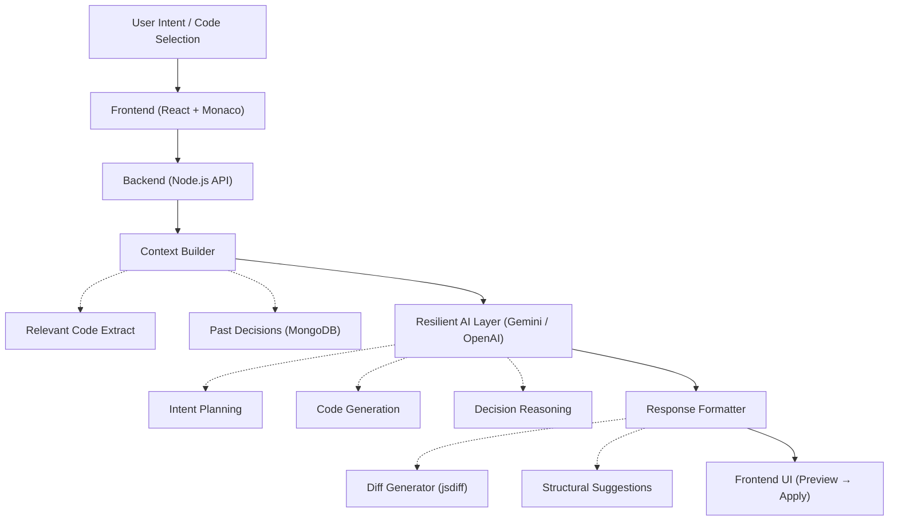

# 🚀 AI Code Editor

> **"This editor is designed to behave like a reasoning-driven senior developer by combining intent understanding, contextual code analysis, and persistent decision memory."**

A premium, AI-powered code assistant built with React, Monaco Editor, and Node.js. Beyond simple code generation, this tool focuses on **Decision Intelligence**—understanding the *why* behind the code.


## 💡 What Makes This Different?
- 🧠 **Reasoning-first AI**: Not just code generation—it understands intent and technical constraints.
- 📚 **Persistent Decision Memory**: The AI remembers *WHY* changes were made, ensuring long-term consistency.
- ⚠️ **Context-aware Analysis**: Provides warnings and suggestions based on the broader system context.
- 🔍 **Safe Execution**: High-fidelity diff previews allow for full human-in-the-loop validation.

## ✨ Core Features

### **👉 Intent Mode (Planning + Execution)**
Transforms natural language instructions into structured engineering plans, analyzes relevant code context, and generates safe updates with a visual diff preview before execution. It’s not just a chat—it’s a task orchestrator.

### **👉 Decision Intelligence (Why Engine)**
The system captures and stores the reasoning behind technical decisions in a persistent store. This data is reused to guide, warn, or challenge future code changes, enabling a truly context-aware development environment.

### **👉 Resilient AI Orchestration Layer**
Supports multiple LLM providers (Gemini & OpenAI) with intelligent fallback. This ensures continuous operation and consistent responses even during API failures or rate limits.

### **👉 Professional Editor Experience**
Integrated with the **Monaco Editor** (VS Code's engine), featuring a premium glassmorphic interface with micro-animations for a high-end feel.

---

## 🧠 How It Works (System Flow)



---

## 🛠️ Tech Stack

- **Frontend**: React 18, Vite, Monaco Editor, Framer Motion, Lucide Icons.
- **Backend**: Node.js, Express, MongoDB, Mongoose.
- **AI Layers**: Google Gemini (v1 stable), OpenAI API.

## 🚀 Getting Started

### **1. Prerequisites**
- Node.js installed.
- MongoDB running locally (`mongodb://localhost:27017/ai-code-editor`).

### **2. Setup Backend**
1. `cd backend`
2. `npm install`
3. Configure your `.env`:
   ```env
   GEMINI_API_KEY=your_key
   OPENAI_API_KEY=your_key
   ```
4. Start: `node server.js`

### **3. Setup Frontend**
1. `cd frontend`
2. `npm install`
3. Start: `npm run dev`

